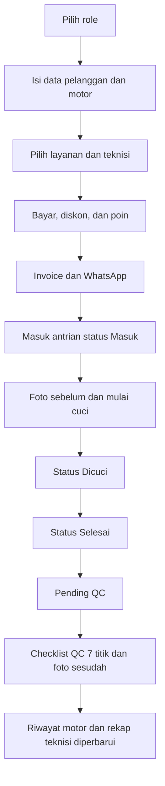

## 1. Product Overview
GEN AUTO CARE is a cashier and motorcycle wash operations system that combines transaction handling, live service queue, quality check, inventory, attendance, customer loyalty, and financial recap in a single application.
- The product is designed for three operational roles: Owner, Manager Ops, and Cashier, with a fast demo login based on role cards rather than passwords.
- The current web implementation should collaborate with the existing React, Vercel, and Supabase foundation, while the long-term production target can also support Google Apps Script plus Spreadsheet as a backend integration path.

## 2. Core Features

### 2.1 User Roles
| Role | Login Method | Core Permissions |
|------|--------------|------------------|
| Owner | Demo role card | Full access to dashboard, cashier detail, queue, inventory edit, QC, attendance, customers, reports, operational costs, recap, settings, and POS access from header |
| Manager Ops | Demo role card | Access to dashboard, cashier detail, queue, inventory edit, QC, attendance, customers, reports, operational costs, recap, and POS access from header |
| Cashier | Demo role card | Access to dashboard, POS mode, cashier detail, queue, attendance, customers, daily reports, and inventory in view-only mode |

### 2.2 Feature Module
1. **Dashboard**: income today versus yesterday, active queue, top technician, attendance summary, stock summary, recent transactions
2. **Kasir Detail**: multi-step customer and vehicle entry, service tier selection, technician selection, payment method, discount, points, invoice, WhatsApp action
3. **Mode POS**: fullscreen cashier view with direct processing, right-side summary panel, bottom live status bar, and embedded queue monitoring
4. **Antrian**: daily kanban with `Masuk`, `Dicuci`, and `Selesai`, including before photo, technician assignment, and QC handoff
5. **Gudang**: stock table, effective stock, automatic usage formula, stock sync, movement verification, and asset total
6. **Quality Check**: 7-point wash checklist, after photo, pending QC list, daily product readiness checklist, and technician quality recap
7. **Absensi**: daily staff table with clock in and clock out
8. **Pelanggan**: customer table, points, vehicle ownership, visit history, and per-vehicle QC history
9. **Laporan Harian**: date filter, payment breakdown, daily totals, and ready-to-send reporting summary
10. **Biaya Operasional**: daily and monthly cost capture with date-range viewing
11. **Rekap & Bagi Hasil**: gross versus net financial recap, inventory material cost effect, and technician commission summary
12. **Pengaturan**: service prices, commission model, material usage per service, technician data, transfer account, QRIS image, and access info

### 2.3 Page Details
| Page Name | Module Name | Feature Description |
|-----------|-------------|---------------------|
| Login | Role cards | Choose Owner, Manager Ops, or Cashier instantly in demo mode |
| Dashboard | KPI and overview | Show income delta, queue counts, attendance, stock summary, and recent activity |
| Kasir Detail | Customer and vehicle step | Search old customers or create new customer and vehicle data |
| Kasir Detail | Service and technician step | Display service tiles by BASIC, STANDARD, PREMIUM, and ELITE tier and assign active technician |
| Kasir Detail | Payment and invoice | Handle discount, points, payment type, invoice preview, and WhatsApp handoff |
| Mode POS | Fullscreen processing | Fast cashier workflow without confirmation dialog |
| Mode POS | Bottom status bar | Open queue and payment breakdown panels directly from operational counters |
| Antrian | Daily kanban | Manage service status, before photo, and transition between queue stages |
| Gudang | Inventory table | Track physical stock, effective stock, formula-based deduction, and stock movements |
| Quality Check | QC checklist | Evaluate 7 wash points, add after photo, and produce a QC score |
| Absensi | Staff table | Record presence, time in, and time out |
| Pelanggan | Customer detail | View points, vehicles, visits, and QC history per vehicle |
| Laporan Harian | Reporting summary | Aggregate transaction count, income, and payment-method totals by date |
| Biaya Operasional | Cost tracking | Record daily and monthly operational expenses |
| Rekap & Bagi Hasil | Finance recap | Show gross, net, modal usage, and technician commission recap |
| Pengaturan | Service and payment config | Configure prices, commissions, technicians, transfer account, and QRIS asset |

## 3. Core Process
The operational flow starts when a cashier enters customer and motorcycle data, chooses a service and technician, completes payment with discount and optional points, generates an invoice, and sends the order to the service queue. The queue then progresses from `Masuk` to `Dicuci`, then `Selesai`, before passing into a QC process that captures a 7-point assessment and the final after-wash quality result for customer history and technician recap.

## 4. User Interface Design
### 4.1 Design Style
- Primary palette: royal blue `#1535d4`, electric lime `#C8F400`, dark surfaces `#111318` and `#1a1c25`, with light application backgrounds `#eef0f5` and `#f7f8fb`
- Typography: `Saira` for display, headings, numeric emphasis, and the italic logo feel, with `Plus Jakarta Sans` for application text
- Layout style: responsive desktop to iPad workflow, with fullscreen POS treatment, operational side panels, and dense card and table combinations
- UI hierarchy: service tiers must be visually obvious, invoice and total sections must be bold, and role-based navigation should hide unauthorized modules
- Icon style suggestions: use `lucide-react` with clean operational strokes

### 4.2 Page Design Overview
| Page Name | Module Name | UI Elements |
|-----------|-------------|-------------|
| Login | Role cards | Large selectable role cards with brand logo and short permission summary |
| Dashboard | KPI grid | Comparison cards, queue indicators, stock snapshot, and attendance panel |
| Kasir Detail | Multi-step flow | Customer search, service tier tiles, technician selection, totals, and WhatsApp action |
| Mode POS | Fullscreen shell | Left service selection, right summary panel, bottom status bar, and quick action controls |
| Antrian | Kanban board | Three columns with before-photo and progress actions |
| Gudang | Data table | Inventory stats, table rows, stock actions, and verification states |
| Quality Check | Checklist form | Score cards, radio-style checklist, photos, and pending QC cards |
| Pelanggan | Customer detail modal | Vehicles, visits, points, and QC history summary |

### 4.3 Responsiveness
The application remains desktop-first but must behave well on tablets, especially for the fullscreen POS mode. Mobile layouts should prioritize readability and operational summaries even if not every workflow is optimized for one-handed use.
