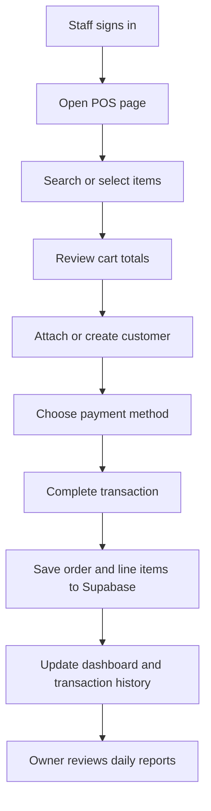

## 1. Product Overview
GEN AUTOCARE Cashier is a desktop-first point-of-sale web app for an auto care business that combines fast checkout, service catalog management, customer history, and daily revenue visibility in one place.
- It helps cashiers and owners reduce manual bookkeeping, speed up service transactions, and keep product and customer records consistent.
- Its value is a lightweight operational system that can be deployed quickly with Vercel and scaled through Supabase without a custom backend in the first release.

## 2. Core Features

### 2.1 User Roles
| Role | Registration Method | Core Permissions |
|------|---------------------|------------------|
| Owner/Admin | Supabase Auth email sign-in | Manage catalog, review reports, manage settings, view all transactions |
| Cashier | Supabase Auth email sign-in | Create orders, manage customers during checkout, view active transaction history |

### 2.2 Feature Module
1. **Dashboard**: daily summary cards, recent transactions, top-selling items, quick actions
2. **POS Page**: item search, cart builder, customer assignment, payment method selection, order completion
3. **Catalog Page**: product and service list, pricing, category filters, active/inactive status
4. **Customers Page**: customer list, quick add form, contact and vehicle notes, visit history summary
5. **Transactions Page**: order history, status filters, payment filters, printable detail view
6. **Reports Page**: daily sales totals, payment breakdown, best-performing services/products
7. **Settings Page**: business profile, tax defaults, receipt preferences, environment readiness status

### 2.3 Page Details
| Page Name | Module Name | Feature Description |
|-----------|-------------|---------------------|
| Dashboard | KPI summary | Show revenue today, transaction count, average basket value, and pending actions |
| Dashboard | Activity feed | Display latest completed transactions and quick navigation links |
| POS Page | Search and select | Search products and services by name, category, or SKU |
| POS Page | Cart management | Add items, adjust quantity, apply discount, and recalculate totals instantly |
| POS Page | Customer panel | Attach existing customer or create a new one during checkout |
| POS Page | Checkout | Save transaction with payment method, notes, and final totals |
| Catalog Page | Product/service table | Create, edit, archive, and filter items with price and stock/service metadata |
| Customers Page | Customer records | Store name, phone, optional vehicle information, and notes |
| Customers Page | Visit history | Show previous orders linked to the customer for context |
| Transactions Page | History table | Filter by date, payment type, and status; review order details |
| Transactions Page | Receipt view | Present a clean printable summary for each transaction |
| Reports Page | Revenue analytics | Aggregate sales totals by day, payment method, and item type |
| Settings Page | Business settings | Save shop identity, tax rate, and cashier workflow defaults |

## 3. Core Process
The primary workflow starts when a cashier signs in, opens the POS page, searches or selects products and services, optionally links a customer, reviews totals, chooses a payment method, and completes the transaction. Managers use the dashboard, transactions, and reports pages to monitor performance and audit daily activity. Catalog and customer maintenance happen continuously in the background as part of normal operations.

## 4. User Interface Design
### 4.1 Design Style
- Primary colors: charcoal black, graphite gray, high-visibility cyan, and safety lime accents
- Button style: rounded rectangular controls with strong contrast, dense utility styling, and clear hover states
- Font and sizes: bold industrial display font for headings, clean readable sans-serif for data-heavy content, compact text scale for dense cashier workflows
- Layout style: desktop-first split panels, sticky action areas, tabular data views, and card-based summaries
- Icon style suggestions: use `lucide-react` icons with clean stroke-based automotive dashboard feel

### 4.2 Page Design Overview
| Page Name | Module Name | UI Elements |
|-----------|-------------|-------------|
| Dashboard | KPI summary | Dark cards, numeric emphasis, micro trend indicators, subtle glow accents |
| POS Page | Cart and checkout | Two-column workspace, sticky totals panel, quick-add chips, compact form controls |
| Catalog Page | Data management | Dense filter bar, table/grid toggle, modal forms, category badges |
| Customers Page | Customer records | Search-first layout, clean profile panels, concise vehicle metadata blocks |
| Transactions Page | History and receipt | Wide data table, filter toolbar, drawer/modal for receipt details |
| Reports Page | Sales analytics | Summary cards, charts, grouped tables, date-range controls |
| Settings Page | Business config | Sectioned forms, configuration cards, readiness checklist |

### 4.3 Responsiveness
The application is desktop-first for cashier counters and back-office use, then adapts to tablet screens with stacked panels and preserved touch targets. Mobile support is secondary and focused on read-only management views rather than full cashier productivity.
