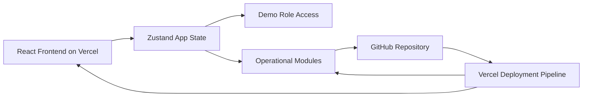
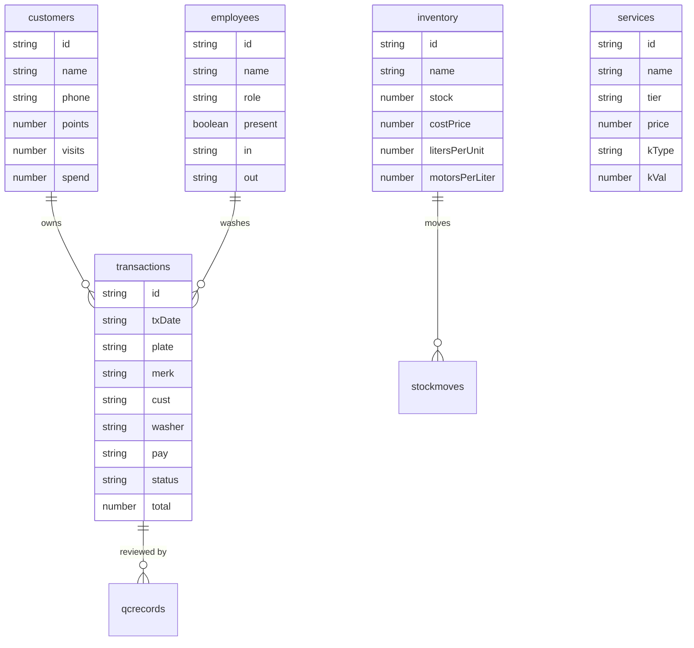

## 1. Architecture Design


## 2. Technology Description
- Frontend: React@18 + TypeScript + Vite + Tailwind CSS
- Routing: `react-router-dom`
- State Management: `zustand`
- Data Layer: collaboration between the current in-app operational state and the existing Supabase-ready foundation
- Charts and UI utilities: lightweight custom UI blocks and simple charts without mandatory extra services
- Deployment: Vercel static deployment connected to GitHub
- Current integration: Supabase project already connected to the workspace
- Future production path: Google Apps Script plus Spreadsheet can mirror the same entity model

## 3. Route Definitions
| Route | Purpose |
|-------|---------|
| / | Dashboard with operational overview and role-aware widgets |
| /cashier | Kasir Detail multi-step cashier flow |
| /pos | Fullscreen POS mode for cashiers and quick access by owner or manager |
| /queue | Daily service queue in kanban format |
| /inventory | Gudang, stock movement, and verification view |
| /quality | Quality check and pending QC workflow |
| /attendance | Staff attendance and daily presence |
| /customers | Customer, vehicle, points, and history management |
| /reports/daily | Daily reporting and payment breakdown |
| /costs | Daily and monthly operational cost tracking |
| /recap | Gross, net, technician commission, and business recap |
| /settings | Owner-only configuration for services, payments, and technicians |

## 4. Client Data Contracts
```ts
export type AppRole = "owner" | "manager_ops" | "kasir";
export type PaymentMethod = "cash" | "qris" | "transfer";
export type QueueStatus = "Masuk" | "Dicuci" | "Selesai";
export type CommissionType = "flat" | "persen";

export interface Service {
  id: string;
  name: string;
  tier: "BASIC" | "STANDARD" | "PREMIUM" | "ELITE";
  price: number;
  kType: CommissionType;
  kVal: number;
  modalItems: string[];
}

export interface Customer {
  id: string;
  name: string;
  phone: string;
  visits: number;
  spend: number;
  points: number;
  vehicles: Vehicle[];
}

export interface Vehicle {
  plate: string;
  merk: string;
}

export interface Transaction {
  id: string;
  txDate: string;
  plate: string;
  merk: string;
  cust: string;
  washerId: string;
  washer: string;
  services: string[];
  total: number;
  komisi: number;
  pay: PaymentMethod;
  status: QueueStatus;
  disc: number;
  finishedAt: string | null;
}

export interface QCRecord {
  id: string;
  txId: string;
  plate: string;
  merk: string;
  washer: string;
  score: number;
  time: string;
}
```

## 5. Frontend Module Design
The current implementation should extend the existing React application rather than rebuild it from scratch. Shared UI belongs in `src/components`, route pages in `src/pages`, utility formatters in `src/utils`, and the core operational state in a centralized Zustand store. Role-based navigation, queue transitions, QC scoring, attendance, stock usage, customer points, and financial recaps should all derive from the same unified front-end state layer so the app behaves consistently in demo mode and remains mappable to future production persistence.

## 6. Data Model
### 6.1 Data Model Definition


### 6.2 Data Definition Language
```sql
-- Current web build may continue using the existing Supabase tables for
-- customers, orders, and order_items, while the expanded production model
-- should add services, employees, qc_records, inventory, stock_moves,
-- operational_costs, tx_photos, and app_settings with a one-sheet-per-entity
-- mapping when moved to Google Apps Script plus Spreadsheet.
```

## 7. Environment and Deployment Notes
- Frontend environment variables: `VITE_SUPABASE_URL` and `VITE_SUPABASE_ANON_KEY`
- Sensitive key for server-side use only: `SUPABASE_SERVICE_ROLE_KEY`
- GitHub should be the source repository for the Vercel project so each push can trigger preview and production deployments
- `vercel.json` should remain available for SPA rewrites in the Vercel deployment
- The production data model must stay compatible with both the current web state and a future Google Apps Script plus Spreadsheet persistence layer
