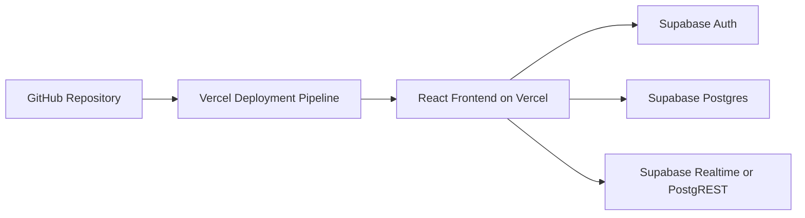
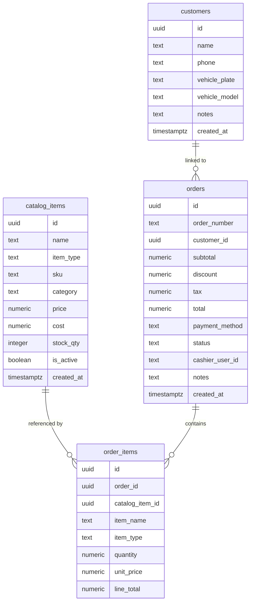

## 1. Architecture Design


## 2. Technology Description
- Frontend: React@18 + TypeScript + Vite + Tailwind CSS
- Routing: `react-router-dom`
- State Management: `zustand`
- Data Layer: `@supabase/supabase-js`
- Charts and UI utilities: lightweight charting and utility libraries only when needed during implementation
- Deployment: Vercel static deployment connected to GitHub
- Database and Auth: Supabase project already connected to the workspace

## 3. Route Definitions
| Route | Purpose |
|-------|---------|
| / | Dashboard landing page with quick operational summary |
| /pos | Main cashier workspace for cart building and checkout |
| /catalog | Manage products and services |
| /customers | Search and manage customer profiles |
| /transactions | Review order history and receipt details |
| /reports | View sales and payment analytics |
| /settings | Manage business preferences and deployment readiness |

## 4. Client Data Contracts
```ts
export type CatalogItemType = "product" | "service";
export type PaymentMethod = "cash" | "card" | "transfer" | "qris";
export type OrderStatus = "completed" | "refunded" | "void";

export interface CatalogItem {
  id: string;
  name: string;
  type: CatalogItemType;
  sku: string | null;
  category: string;
  price: number;
  cost: number | null;
  stockQty: number | null;
  isActive: boolean;
  createdAt: string;
}

export interface Customer {
  id: string;
  name: string;
  phone: string | null;
  vehiclePlate: string | null;
  vehicleModel: string | null;
  notes: string | null;
  createdAt: string;
}

export interface Order {
  id: string;
  orderNumber: string;
  customerId: string | null;
  subtotal: number;
  discount: number;
  tax: number;
  total: number;
  paymentMethod: PaymentMethod;
  status: OrderStatus;
  cashierUserId: string;
  notes: string | null;
  createdAt: string;
}

export interface OrderItem {
  id: string;
  orderId: string;
  catalogItemId: string | null;
  itemName: string;
  itemType: CatalogItemType;
  quantity: number;
  unitPrice: number;
  lineTotal: number;
}
```

## 5. Frontend Module Design
The first implementation should use a frontend-only architecture that talks directly to Supabase through the public URL and anon key, with row-level security protecting data access. Shared data fetching utilities should live in `src/utils`, route pages in `src/pages`, and reusable UI blocks in `src/components`. Global cashier workflow state such as the active cart, filters, and current transaction draft should live in a Zustand store.

## 6. Data Model
### 6.1 Data Model Definition


### 6.2 Data Definition Language
```sql
create table if not exists public.catalog_items (
  id uuid primary key default gen_random_uuid(),
  name text not null,
  item_type text not null check (item_type in ('product', 'service')),
  sku text,
  category text not null default 'general',
  price numeric(12,2) not null default 0,
  cost numeric(12,2),
  stock_qty integer,
  is_active boolean not null default true,
  created_at timestamptz not null default now()
);

create table if not exists public.customers (
  id uuid primary key default gen_random_uuid(),
  name text not null,
  phone text,
  vehicle_plate text,
  vehicle_model text,
  notes text,
  created_at timestamptz not null default now()
);

create table if not exists public.orders (
  id uuid primary key default gen_random_uuid(),
  order_number text not null unique,
  customer_id uuid,
  subtotal numeric(12,2) not null default 0,
  discount numeric(12,2) not null default 0,
  tax numeric(12,2) not null default 0,
  total numeric(12,2) not null default 0,
  payment_method text not null check (payment_method in ('cash', 'card', 'transfer', 'qris')),
  status text not null default 'completed' check (status in ('completed', 'refunded', 'void')),
  cashier_user_id text not null,
  notes text,
  created_at timestamptz not null default now()
);

create table if not exists public.order_items (
  id uuid primary key default gen_random_uuid(),
  order_id uuid not null,
  catalog_item_id uuid,
  item_name text not null,
  item_type text not null check (item_type in ('product', 'service')),
  quantity numeric(12,2) not null default 1,
  unit_price numeric(12,2) not null default 0,
  line_total numeric(12,2) not null default 0
);

alter table public.catalog_items enable row level security;
alter table public.customers enable row level security;
alter table public.orders enable row level security;
alter table public.order_items enable row level security;

grant select, insert, update, delete on public.catalog_items to authenticated;
grant select, insert, update, delete on public.customers to authenticated;
grant select, insert, update, delete on public.orders to authenticated;
grant select, insert, update, delete on public.order_items to authenticated;

create policy "authenticated catalog access"
on public.catalog_items
for all
to authenticated
using (true)
with check (true);

create policy "authenticated customer access"
on public.customers
for all
to authenticated
using (true)
with check (true);

create policy "authenticated order access"
on public.orders
for all
to authenticated
using (true)
with check (true);

create policy "authenticated order item access"
on public.order_items
for all
to authenticated
using (true)
with check (true);
```

## 7. Environment and Deployment Notes
- Frontend environment variables: `VITE_SUPABASE_URL` and `VITE_SUPABASE_ANON_KEY`
- Sensitive key for server-side use only: `SUPABASE_SERVICE_ROLE_KEY`
- GitHub should be the source repository for the Vercel project so each push can trigger preview and production deployments
- `vercel.json` should be added during implementation only if route rewrites or deployment-specific behavior become necessary
